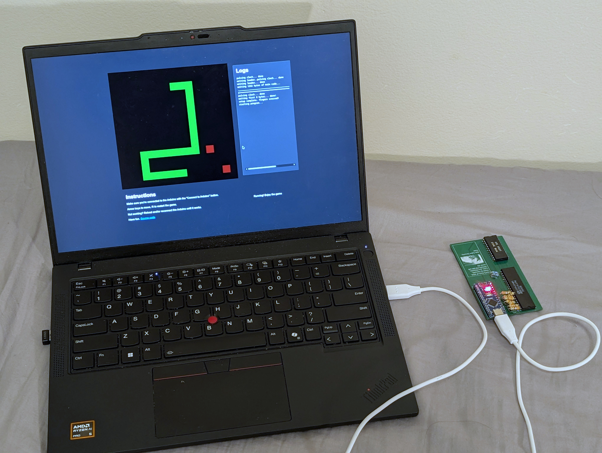

# snakez80

Snake running on a custom Z80 computer. Made for TEJ4MP.

# Requirements

- A Z8400-compatible CPU.
- A TMM2016BP memory chip or compatible.
- A PCB with the KiCAD design (TODO: add link to kicad design), or a breadboard with the equivalent schematic.
- An Arduino Nano.

Connect everything, flash the [loader code](./loader) with the Arduino IDE, and open [`web/index.html`](web/index.html) or https://creative0708.github.io/snakez80/ in a browser.

Have fun.

# Building `rom.hpp` from source

You'll need a set of [z88dk](https://github.com/z88dk/z88dk) binaries **with** SDCC. Follow its [installation instructions](https://github.com/z88dk/z88dk/wiki/installation) to install it.

Run `make` to build the ROM and convert the ROM into Arduino code.

# License

If for some reason you want to use this code, it's licensed under the [MIT License](/LICENSE).
